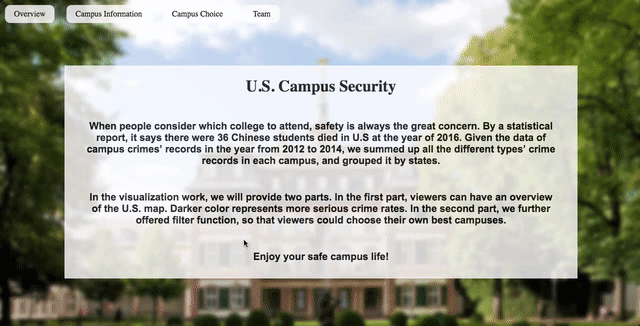
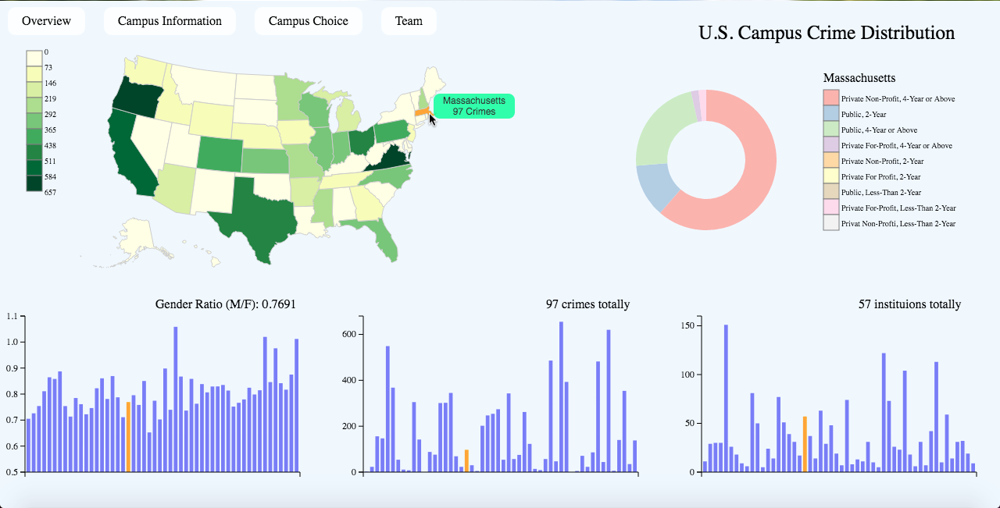
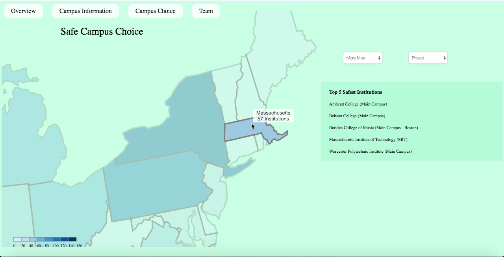

# Description of the Project

## Team
- Zhanfeng Huang
- Qiankun Li
- Yujun Tian

## Link
Project Website: https://danielwwong.github.io/DataVisFinal/

Screencast Video:
https://youtu.be/29euFIj2n6I

## Overview

We created a website for students to choose campus based on the states' overall campus crime rates. With vivid data visualization, hopefully, our website would be a guidance for the students.

## Code and Data

Code: index.html is our website's page, also we used states.json to draw the U.S. Map.

Library: All our data is in Data folder, crimeDevidedByStates.csv, dataset.csv, schoolType.csv, and sum.csv provide all the data we drew the charts. Also, we used fullpage.js to realize the scrolling effect.

## Non-obvious Features of Our Interface

**U.S. Campus Crime Distribution**

We provide states' crime data in several interactive charts. All of them are connected, you would see the specific states' detailed data.

**Safe Campus Choice**

We also provide a filter to choose schools in a specific state. By choosing the viewers preferences, you would see the top 5 safest schools in the state.

## References

Move to Front:
https://gist.github.com/trtg/3922684

Full Page Scroll:
http://alvarotrigo.com/fullPage/

Select Box:
https://authenticstyle.co.uk/how-to-style-select-boxes-using-css-and-html/

Color of the Map:
http://colorbrewer2.org/

Data:
https://ope.ed.gov/campussafety/#/datafile/list
